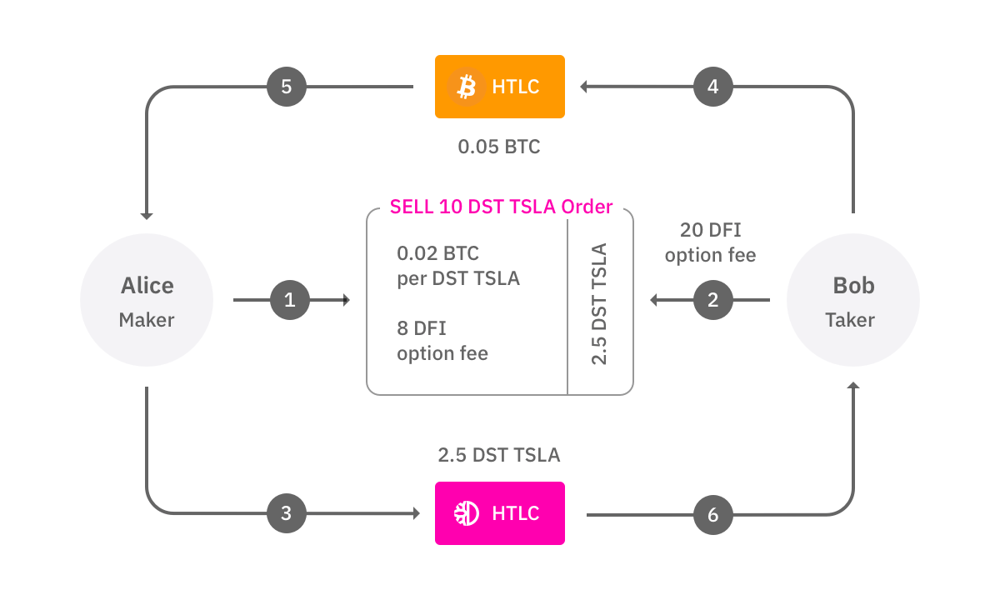
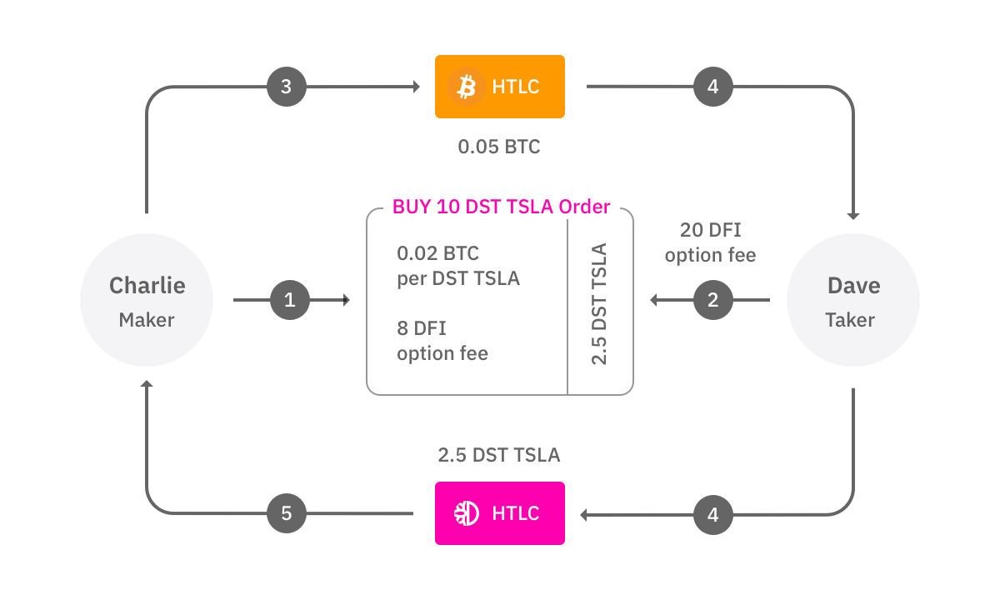

# Interchain Excahnge

## Goals

Allow users to trustlessly and seamlessly swap between DST and Bitcoin BTC. BTC in the rest of this document will only referring to BTC on Bitcoin blockchain and not BTC DST.

Key areas of focus, in decreasing order of importance:

1. Safety
2. User experience – it should be easily presentable on a client UI
3. Seamlessness - most of the steps should be automated at client

## Components

1. Hash Time Lock Contract
    - A.k.a. HTLC
    - Part of Bitcoin script, and DFC side, it's a new construct for DST.
    - Requires both participants to be active.
    - H = Hash(S)

2. Inter-chain Exchange
    - A.k.a. ICX / XCX
    - This is on-chain (DeFiChain) trustless exchange with "traditional" orderbook

3. SPV wallet
    - Simple Payment Verification Bitcoin wallet
    - Distributed as part of DeFiChain node
    - This is why we are only supporting Bitcoin, at least for now.

## Glossary

1. Buyer vs Seller
1. Maker vs Taker

## Scenarios

2 scenarios:

1. DST seller maker, wants BTC
    - Paired with BTC seller taker

1. BTC seller maker, wants DST
    - Paired with DST seller taker

## Scenario 1

Alice
    - Sells DST, wants BTC
    - Maker

Bob
    - Sells BTC, wants DST
    - Taker

1. Alice, as maker, puts up an order:
    - For sale: 10 TSLA DST
    - unitPrice: 0.02 _(BTC - $800 each for BTC at $40k)_
    - expiry: 2880 blocks
    - optionFeePerUnit: 8 _(DFI)_

2. Bob, as taker:
    - Wants to buy just 2.5 TSLA, not all 10. _(partial order)_
    - Makes an acceptance offer.
    - Transmits `optionFeePerUnit * unit` 8 * 2.5 = 20 DFI alongside the order into HTLC. No payment DFI is locked up yet, only 20 DFI for optionFee
    - UX: either browse orderbook, or do a market order _(easier: always match with the best price)_

3. Alice accepts the offer
    - UX side this is automatically accepted
    - Moves 2.5 TSLA from the order into DFC DST HTLC (also known as ICX Contract).
    - Properties of HTLC:
        - 2.5 TSLA locked up for 120 blocks (1 hour)
        - with H provided, where H = Hash(S) the funds for Bob can be unlocked from this HTLC.

4. Bob sees the DST HTLC, verifies the following:
    - Amount, token, time locked up and recipient is correct.
    - Waits for sufficient confirmation at DFC side to ensure finality.
    - Bob, now initiates on the Bitcoin side, HTLC for:
        - 2.5 * 0.02 = 0.05 BTC
        - With the same H. Take note that Alice knows S, but Bob does not know S.
        - Time limit is 30 minutes.
    - Bob updates ICX C on this HTLC.

5. Alice accepting Bitcoin
    - Alice confirms that HTLC properties are correct, amount, time, recipient.
    - Waits for sufficient confirmation at Bitcoin blockchain to ensure finality.
    - Claims Bitcoin by revealing S.

6. Bob now claims DST.
    - Bob sees that Alice has claimed and revealed S.
    - Bob claims DST too by using the same S.
    - DST is claimed on ICX C itself, this sends DST to Bob, and refunds Bob the `optionFee`.

### Bad actors

1. N/A
2. N/A
3. If Alice does not accept, Bob's offer expires after 20 blocks and takes back `optionFee`.
4. If Bob does not honor the BTC side, Alice receives back her 2.5 TSLA after 1 hour + `optionFee`.

## Scenario 2

Charlie
    - Sells BTC, wants DST
    - Maker

Dave
    - Sells DST, wants BTC
    - Taker

1. Charlie, as maker, puts up an order:
    - Buying: 10 TSLA DST
    - unitPrice: 0.02 _(BTC - $800 each for BTC at $40k)_
    - expiry: 2880 blocks
    - optionFeePerUnit: 8 _(DFI)_

2. Dave, as taker:
    - Wants to sell just 2.5 TSLA, not all 10. _(partial order)_
    - Makes an acceptance offer.
    - Transmits `optionFeePerUnit * unit` 8 * 2.5 = 20 DFI alongside the order into HTLC. No payment DFI is locked up yet, only 20 optionFee DFI.
    - UX: either browse orderbook, or do a market order _(easier: always match with the best price)_

3. Charlie accepts the offer
    - Charlie comes up with S. Computes H where H = Hash(S).
    - Charlie locks up BTC on the Bitcoin HTLC for:
        - 2.5 * 0.02 = 0.05 BTC
        - With H. Take note that Charlie knows S, but Dave does not know S.
        - Time limit is 1 hour (6 blocks).
    - and creates ICX Contract with H, and Bitcoin HTLC address.
    - Dave's `optionFee` is locked in ICX C.

4. Dave sees that Charlie has accepted the offer and that BTC is now locked in HTLC
    - Validates that BTC HTLS is correctly set up - amount, time, recipient
    - Waits for sufficient confirmation on BTC side to ensure finality.
    - Moves 2.5 TSLA from the order into DFC ICX C (no need to provide H as contract already know H)

5. Charlie accepts DST
    - Waits for sufficient confirmation on DFC side to ensure finality.
    - Claims DST by revealing S
    - This sends DST to Charlie and refunds `optionFee` to Dave.

6. Dave now claims BTC
    - using the same S on the BTC HTLC

### Bad actors

1. N/A
2. N/A
3. If Charlie does not accept, Bob's offer expires after 10 blocks and takes back `optionFee`.
4. If Bob does not honor the BTC side, Alice receives back her 2.5 TSLA after 1 hour + `optionFee`.

# Override Notice: Fees and Incentives

_TODO: Cleanup this document to be coherent_

The above document has parts overriden by the [fees document](fees.md).
